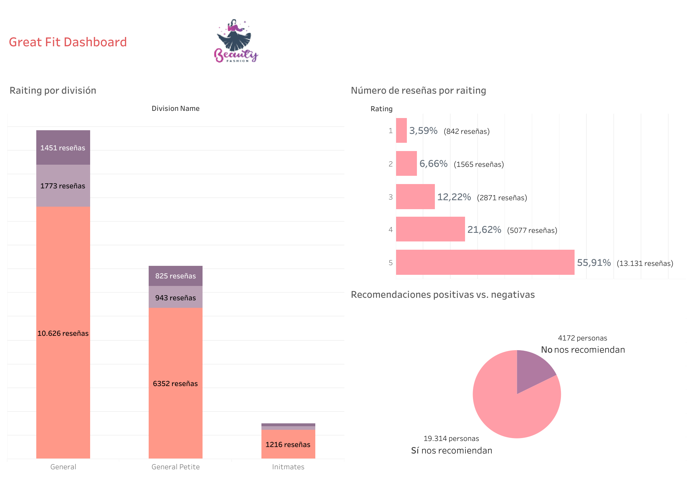
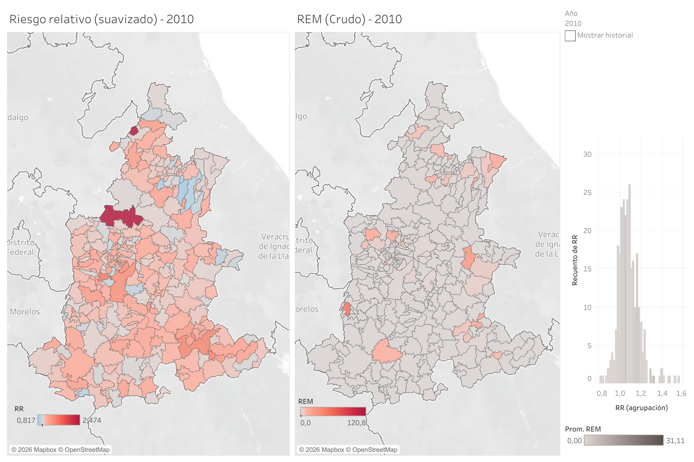
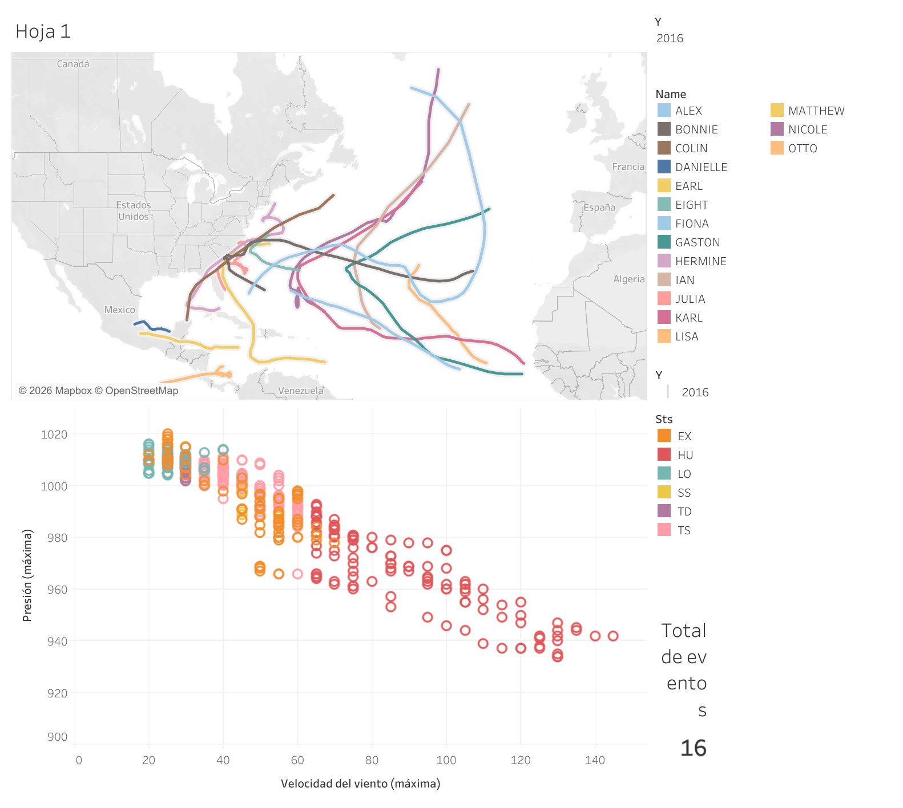

# Tableau Public — Galería de visualizaciones

Repositorio de portafolio con una selección de dashboards y mapas publicados en **Tableau Public**.  
Incluye proyectos de análisis de ventas (BI) y visualizaciones temáticas con componente espacial (salud, clima y movilidad humana).

**Perfil Tableau Public:** https://public.tableau.com/app/profile/mar.a.fernanda.gonz.lez.mora8314/vizzes

---

## Proyectos

### 1) Great Fit Dashboard (BI / Retail)

- **Objetivo:** sintetizar desempeño de ventas y reseñas para apoyar decisiones comerciales.
- **Incluye:** filtros, KPIs, comparaciones y visuales para distribución de ratings.
- **Link:** [Ver en Tableau Public](https://public.tableau.com/app/profile/mar.a.fernanda.gonz.lez.mora8314/viz/GreatFitDashboard_17597277398470/Dashboard1)

---

### 2) Mapeo de leucemia entre jóvenes de 0 a 19 años en Puebla y Tlaxcala (2010–2020) (Salud + espacial)

- **Objetivo:** explorar patrones territoriales y variación temporal en indicadores de salud.
- **Incluye:** mapas comparativos por año, métricas normalizadas y controles de exploración.
- **Link:** [Ver en Tableau Public](https://public.tableau.com/app/profile/mar.a.fernanda.gonz.lez.mora8314/viz/Mapeodeleucemiaentrejvenesde0a19aosde2010-2020/Dashboard1)

---

### 3) Huracanes en el Atlántico (2016–2021) (Clima / trayectorias)

- **Objetivo:** visualizar trayectorias e intensidad para lectura espacial–temporal.
- **Incluye:** rutas por evento, comparación por año y exploración interactiva.
- **Link:** [Ver en Tableau Public](https://public.tableau.com/app/profile/mar.a.fernanda.gonz.lez.mora8314/viz/HuracanesenelAtlntico/Dashboard1)

---

### 4) Incidentes de migrantes en tránsito (Territorio / movilidad humana)

- **Objetivo:** comunicar concentración territorial de incidentes y perfiles por origen.
- **Incluye:** mapas temáticos, agregación por región y paneles comparativos.
- **Link:** [Ver en Tableau Public](https://public.tableau.com/app/profile/mar.a.fernanda.gonz.lez.mora8314/viz/Incidentesdemigrantesentrnsito/Dashboard1)

---

## Herramientas y habilidades
- Tableau Public / Tableau Desktop (publicación y storytelling)
- Visual analytics: KPIs, ranking, distribución y segmentación
- Cartografía en Tableau: mapas coropléticos, puntos agregados, capas y filtros

---

## Nota
Este repositorio funciona como **galería** (capturas + links).  
Los datos provienen de fuentes públicas/educativas; no se comparten credenciales ni información sensible.

